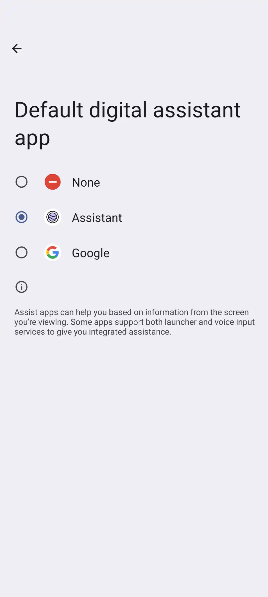

# KagiAssistant

Native Material You Android app for Kagi Assistant.

## Features

- 🎨 Material You with full dynamic theming
- 🔐 One-tap Kagi sign-in
- 🎛️ Set as default assistant
- 📳 High-quality haptic feedback

## Screenshots

### App

|  |  |         |
|----------------------------------------------------------|----------------------------------------------------------|-----------------------------------------------------------------|
|  |  |  |

### Digital Assistant

https://github.com/user-attachments/assets/a6214f1d-f0c4-4bac-9518-4d4adf76bcbc

> Use of the mini overlay is enabled by default, but it’s optional. In Settings, you can turn it off
> so that when you invoke the assistant, the app opens in its full view instead.

## Installation

1. Download the `.apk` from [Releases](https://github.com/httpjamesm/KagiAssistant/releases).
2. Click on the `.apk` file in your Downloads and click "Install"

> Your device must be running **Android 13 or later**. Otherwise, you will likely encounter a
> package parsing error when attempting to install the app.
>

## Why?

The current Kagi Assistant web app has several areas where the experience, particularly on mobile
devices, could be improved.

1. Many mobile UI elements do not meet
   the [48 px touch target guideline](https://www.w3.org/WAI/GL/mobile-a11y-tf/wiki/Proposed_SC_Target_Size#:~:text=This%20converts,the%20target.),
   which makes interactions uncomfortable.
2. The thread list lacks lazy loading, resulting in slow searching and rendering when managing a
   large number of threads (for example, in the thousands) that affect all interactions.
3. The Kagi Assistant “app” on Android currently runs in a basic WebView, which limits support for
   native digital assistant features such as invocation-based launching or a lightweight,
   non-intrusive overlay.
4. Several small but meaningful UX enhancements—such as gesture support, quick access to recent or
   frequently used models, haptic feedback, and subtle animations, are missing, which make the
   experience feel cheap. People like beautiful things.

## Meta

- Create issues for feature requests.
- Not officially endorsed by Kagi Inc. but they don't mind third party apps for personal use.
